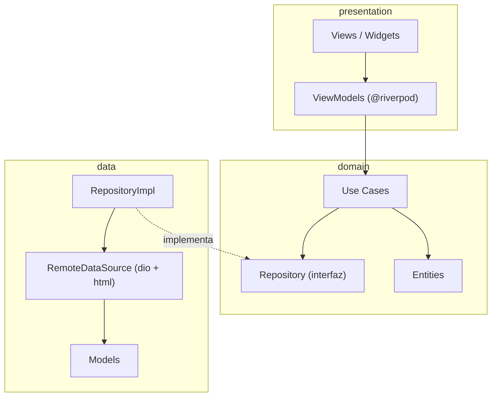
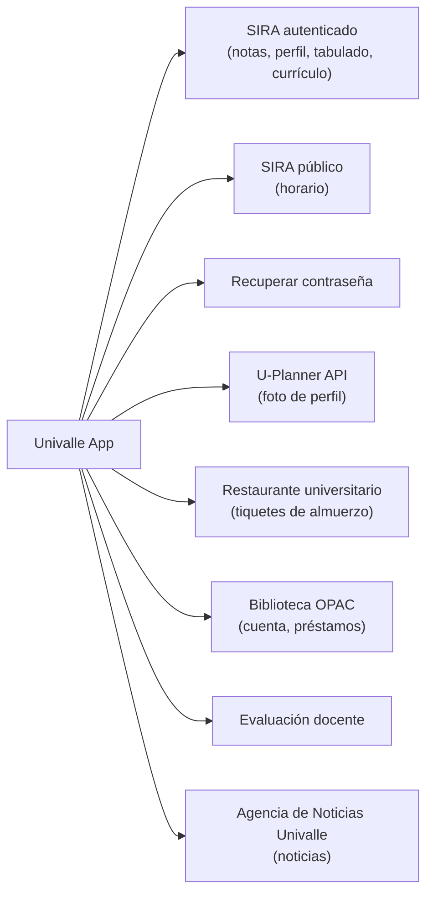
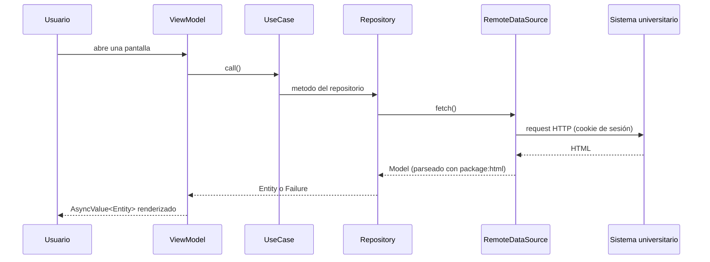

<p align="center">
  
</p>

<h1 align="center">Univalle App</h1>

<p align="center">
  App móvil no oficial para estudiantes de la Universidad del Valle (Colombia): centraliza notas, horario, tabulado, currículo, carné digital, restaurante universitario y biblioteca en una sola interfaz.
</p>

> [!IMPORTANT]
> Proyecto en fase de desarrollo activo. Ver [Funcionalidades](#funcionalidades) para el estado real de cada módulo.

## Descripción

Univalle App nació con el objetivo de centralizar en un solo lugar los distintos servicios que la Universidad del Valle expone hoy en sistemas separados (SIRA, U-Planner, el restaurante universitario, la biblioteca OPAC, evaluación docente, la Agencia de Noticias), cada uno con su propia sesión y su propia forma de pedir la información. La app se conecta a cada uno de esos sistemas y traduce lo que obtiene a un lenguaje de dominio propio, para que la persona usuaria tenga una sola experiencia consistente sin lidiar con SIRA ni con sus formularios.

## Arquitectura

El proyecto sigue **MVVM + Clean Architecture**, organizado *feature-first*: cada funcionalidad vive en `lib/features/<feature>/` con sus propias capas `domain`, `data` y `presentation`; lo compartido entre features vive en `lib/core`. El estado y la inyección de dependencias se manejan con **Riverpod**.



Puntos clave de esta arquitectura:

- **La capa de dominio no depende de HTTP ni de HTML.** Solo la capa de datos sabe que la información viene de scraping, así que el resto de la app queda desacoplado de cómo se obtienen los datos.
- **Errores tipados de punta a punta.** La UI nunca recibe una excepción cruda: siempre un mensaje ya listo para mostrar a la persona usuaria.
- **Widgets, colores y textos compartidos viven en `core/`**, evitando duplicar estilos o copys entre features.

### Estructura del proyecto

```
lib/
├── core/
│   ├── constants/     # AppStrings, AssetPaths
│   ├── error/         # AppException, Failure, mapeo de errores
│   ├── network/       # Un Dio + CookieJar por sistema externo
│   ├── router/        # go_router (@riverpod), AppRoutes
│   ├── session/       # Providers de sesión (usuario, foto actual)
│   ├── storage/       # SharedPreferences, sesión local
│   ├── theme/         # AppTheme, AppColors
│   ├── utils/
│   ├── extensions/
│   └── widgets/       # Componentes compartidos entre features
└── features/
    ├── auth/                 # Login, logout, recuperar contraseña
    ├── profile/              # Datos del estudiante + foto (U-Planner)
    ├── home/                 # Dashboard y accesos directos
    ├── student_grades/       # Notas y promedio
    ├── student_tabulate/     # Tabulado de materias
    ├── resolution/           # Currículo / plan de estudios
    ├── schedule/             # Horario de clases
    ├── teaching_rating/      # Evaluación docente
    ├── digital_card/         # Carné estudiantil digital
    ├── news/                 # Noticias de la Agencia de Noticias Univalle
    ├── restaurant/           # Tiquetes de almuerzo (en desarrollo)
    └── library/              # Cuenta de biblioteca (en desarrollo)
```

Cada feature repite el mismo patrón interno:

```
features/<feature>/
├── domain/{entities,repositories,usecases}
├── data/{datasources,models,repositories}
└── presentation/{providers,viewmodels,views,widgets}
```

## Flujo de datos: web scraping

No hay backend propio: cada feature con datos reales de la universidad negocia su propia sesión (cookie) contra el sistema que le corresponde.



Y así se ve una petición típica, de punta a punta:



De los 8 sistemas externos, U-Planner es la única API JSON real; el resto se scrapea desde HTML, en varios casos en Latin-1 y con un parsing bastante posicional, porque cada sistema expone la información de forma distinta.

## Funcionalidades

| Funcionalidad | Estado |
|---|---|
| Autenticación (login, logout, recuperar contraseña) | ✅ |
| Perfil del estudiante (datos + foto) | ✅ |
| Calificaciones por semestre y promedio | ✅ |
| Tabulado de materias | ✅ |
| Currículo / resolución del programa | ✅ |
| Horario de clases | ✅ |
| Calificar docentes | ✅ |
| Carné estudiantil digital | ✅ |
| Noticias de la Agencia de Noticias Univalle | ✅ |
| Restaurante universitario (tiquetes de almuerzo) | 🔧 En desarrollo |
| Biblioteca (cuenta, préstamos) | 🔧 En desarrollo |
| Enlaces de interés | ❌ Pendiente |

Todas las funcionalidades, incluidas las pendientes, ya tienen su acceso directo en la pantalla de inicio (`Ver todos`); las que aún no están listas muestran un aviso de "muy pronto" en vez de un elemento sin respuesta.

## Tecnologías

- **Flutter** — UI multiplataforma.
- **Riverpod** (`flutter_riverpod` + `riverpod_annotation`, codegen) — estado e inyección de dependencias.
- **go_router** — navegación declarativa, también generado vía `@riverpod`.
- **dio** + **dio_cookie_manager** + **cookie_jar** — cliente HTTP y sesión por cookie, uno por sistema externo.
- **html** — parsing de HTML para el scraping.
- **shared_preferences** — sesión y credenciales guardadas localmente.
- **flutter_svg**, **google_fonts**, **barcode_widget**, **webview_flutter**, **url_launcher**, **intl** — UI y utilidades.

## Visión a futuro

A futuro nos gustaría depender menos de hacer scraping directamente desde el dispositivo de cada estudiante, tanto por mantenibilidad (un cambio en la web de la universidad no debería obligar a publicar una nueva versión de la app) como por seguridad (hoy las credenciales se guardan localmente para poder re-autenticar). Todavía es una idea en evaluación, no una decisión tomada: no tenemos claro cuál es el límite real de peticiones que toleran los sistemas de la universidad ni el riesgo de que centralizar el tráfico termine en un bloqueo de IP, así que cualquier cambio de arquitectura en esta dirección se validará con cuidado antes de comprometernos con un diseño concreto.

## Empezando

**Requisitos**: Flutter 3.47.3 (canal stable) / Dart 3.13.3, o cualquier versión compatible con el rango `^3.13.3` declarado en `pubspec.yaml`.

```bash
git clone https://github.com/code3743/univalle_app.git
cd univalle_app
flutter pub get
```

El proyecto usa Riverpod con codegen, así que hace falta generar el código (`*.g.dart`, no versionado) antes de correr la app:

```bash
dart run build_runner build --delete-conflicting-outputs
```

La app lee la URL del backend de configuración remota (`lib/core/constants/api_constants.dart`) desde la variable de entorno `API_BASE_URL`, así que hay que pasarla con `--dart-define` al correr o compilar:

```bash
flutter run --dart-define=API_BASE_URL=https://tu-backend/api
```

> [!NOTE]
> Si corrés desde VS Code, configurá el mismo `--dart-define` como `toolArgs` en `.vscode/launch.json` (no versionado) para no tener que pasarlo a mano en cada debug/run.

## Compilación

```bash
flutter build apk --split-per-abi
```

> [!NOTE]
> Para más detalles sobre compilación y firma, consulta la [documentación oficial de Flutter](https://docs.flutter.dev/deployment/android).

## Contribuir

¡Las contribuciones son bienvenidas! Antes de abrir un pull request, revisa la [guía de contribución](CONTRIBUTING.md) y el [código de conducta](CODE_OF_CONDUCT.md).

### Convenciones de commits

Los mensajes de commit siguen el formato de [Conventional Commits](https://www.conventionalcommits.org/es/v1.0.0/):

```
tipo(alcance): descripción breve en presente
```

- **tipo**: `feat`, `fix`, `refactor`, `docs`, `style`, `test`, `chore`.
- **alcance** (opcional): el feature o módulo afectado, p. ej. `auth`, `library`, `home`.

Ejemplos:

```
feat(library): implement library account management
refactor(home): update library shortcut to navigate directly
```

Un workflow de GitHub Actions valida que el **título del pull request** cumpla este formato; un PR con un título que no lo cumpla no pasará el check.

## Licencia

Este proyecto está licenciado bajo la [MIT License](LICENSE).

## Contribuidores

<a href="https://github.com/code3743/univalle_app/graphs/contributors">
  
</a>
